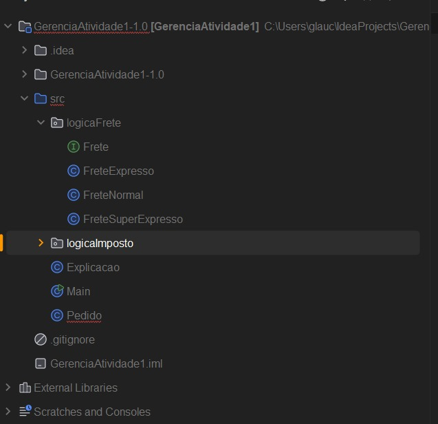
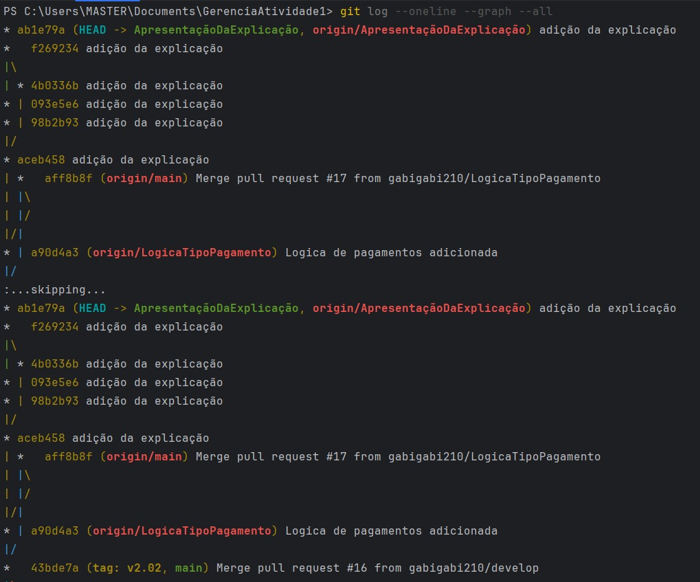
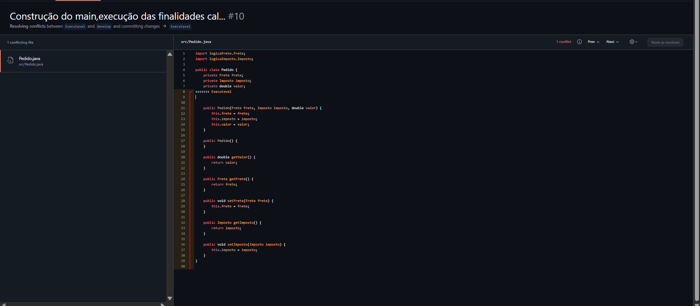
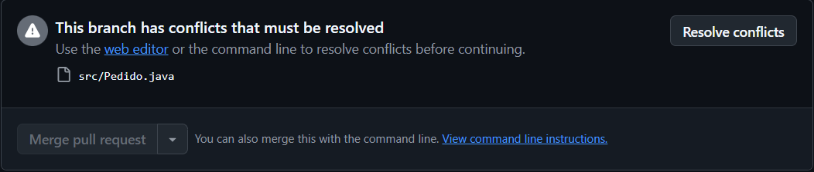
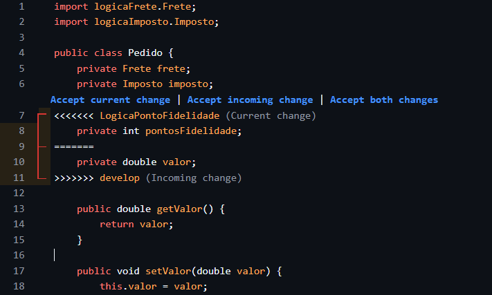
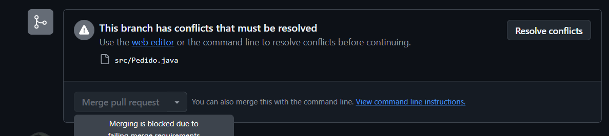
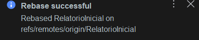
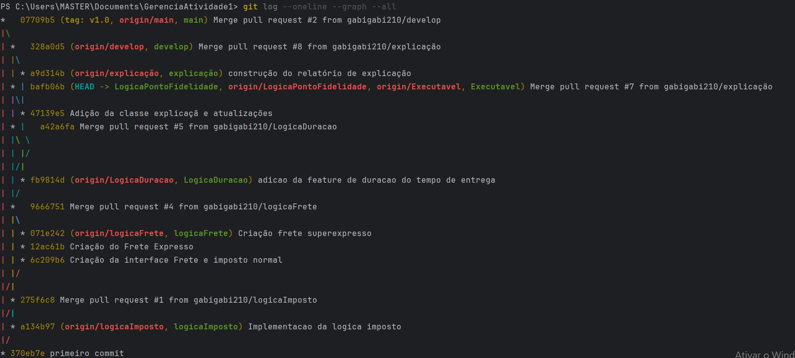

# RELATÓRIO DE PROJETO – Estratégias de Branching em Git

## Identificação
- *Integrantes da equipe*:
    - Glauco Cordeire Siqueira
    - Kaick José Pita de Mendonça Lopes
    - Maria Gabriela Santos Melo

- *Repositório GitHub: [https://github.com/gabigabi210/GerenciaAtividade1]

---

## 1. Estrutura Inicial
- Branch principal (main) criada e configurada? *Sim*.
- Branch develop criada a partir de main? *Sim*.
- Descreva como foi feita a configuração inicial (comandos usados e prints).
    - O projeto foi iniciado com arquivos java, contendo SRC e sem Readme.
    - A branch develop foi criada e enviada ao remoto:

     - git branch develop
     - git push -u origin develop.

- Após a criação da branch develop, cada integrante ficou responsável em criar suas branches
- **[PRINT da estrutura inicial do git branch]**

---

## 2. Fase 1 – Git Flow

### 2.1 Features
- Quais features foram criadas?

- *Kaick*: feature/LogicaFrete e feature/Executavel.

- *Gabriela*: feature/LogicaImposto e feature/Explicação.

- *Glauco*: feature/LogicaDuração e feature/PontoFidelidade.

- Lista das branches de features e detalhe de alterações, em ordem.
    - feature/LogicaFrete: Cálculo do frete baseado no tipo de frete que teríamos no nosso sistema.
    - feature/LogicaImposto: Cálculo do imposto baseado nas leis de importação.
    - feature/LogicaDuração: Tempo de durução de cada frete.
    - feature/Explicação: Função detalhada para o cliente entender todos os valores, tempo e detalhes do seu produto.
    - feature/PontoFidelidade: Cálculo para saber quanto o cliente ira ganhar de pontos de fidelidade a parti do valor da sua compra.
    - feature/Executavel: Criação da classe para executar o sistema, não Houve a iplementação da logica de explicação por ainda não estar completa, entretanto as outras fucionalidades foram implementadas.
    -

- Prints dos commits:
    - **[PRINT do histórico das branches]**

### 2.2 Conflitos
- Conflito 1:
    - O conflito ocorreu no arquivo **Pedido**, especificamente na função de declaração do valor.
    - O *Gabriela* deu merge na feature/Explicacao em develop.
    - O *Kaick* Não puxou todas as alterações que Gabriela fez e fez novamente as mesmas linhas de código que ja tinha de valor. Com isso, tentou dar merge na feature/Executavel com as linhas de códico duplicada e o conflito foi detectado, pois ambas as branches alteraram as mesmas linhas dentro de Pedido().

- Solução do conflito 1:
    - Kaick resolveu o conflito pelo github, apagando as linhas de código duplicadas.
    - O conflito foi resolvido durante o commit do merge na branch develop.

- Prints conflito 1:

  
  

- Conflito 2:
    - O conflito ocorreu no arquivo **Pedido**, especificamente na função de declaração da pontuação e do valor.
    - O *Kaick* deu merge na feature/Executavel em develop.
    - O *Glauco* Não puxou todas as alterações que kaick fez e criou a lógica de pontos de fidelidade. Com isso, não deu pull nas alterações de Kaick.

- Solução do conflito 1:
    - Glauco resolveu o conflito pelo github, juntando as duas implementações.
    - O conflito foi resolvido durante o commit do merge na branch develop.

- Prints conflito 2:

### 2.3 Release
- Criada branch release/2.0? **Não, criamos apenas tag 2.0.**
- Alterações preparatórias versão 2.0
    - Integração com main e geração da tag v2.0.
    - A develop foi integrada em main para sincronizar.
    - Na tag 2.0 foi implementada o main e verificações das fucionalidades

### 2.4 Hotfix
- Qual foi o problema corrigido?
    - Um bug em um dos impostos, no qual estava sendo calculado errado (na branch main): a função Impostoacima50 estava retornando um valor incorreto, devido sendo cáculdado dessa forma: return valor + (0.6 * valor) + (0.18 * valor), entretanto a forma correta era: return valor + (0.8 * valor) + (0.18 * valor).
- Como foi feito o merge do hotfix em main e develop?
    - A branch hotfix/2.0.1 foi criada a partir de main.
    - O commit de correção foi aplicado.
    - **Em main**: Merge direto e criação da tag v2.0.1.

     git checkout main
     git merge hotfix/2.0.1
     git tag v2.0.1

### 2.5 Uso de Rebase
- Em qual feature aplicaram git rebase? Sim
- Adição do relatório da primeira parte da ativiade, da branch Relatorio para develop.

       git rebase develop
---
## Fase  2 – Trunk-Based Development

### 3.0 Fase Trunk-Based

### 3.1 Branches Curtos
Quais branches foram criados a partir de main?
- feature/LogicaTipoPagamento
- feature/ApresentaçãoDaExplicação
- feature/AjusteExecutavel
-Quantos commits cada um teve?
  - Todos os branches tiveram 1.

### 3.2 Squash
- Qual merge foi feito usando squash?
  - O merge da branch feature/AjusteExecutavel. foi feito usando squash.
- Por que foi escolhido squash em vez de merge normal?
- Foi escolhido squash para condensar 1 commit pequeno**  A feature era de "AjusteExecutavel" e a equipe julgou que o resultado final (o código limpo). O commit final na main representa a feature completa.

### 3.3 Tag Final
- Tag criada: v3.0.
  - Ela foi feita depois da finalização deste relatório.

[INCLUA PRINT do git log mostrando a tag v3.0 no final da main]

---

Histórico de Commits
Foi usado esse comando para pegar o histórico:

    git log --oneline --graph --all

